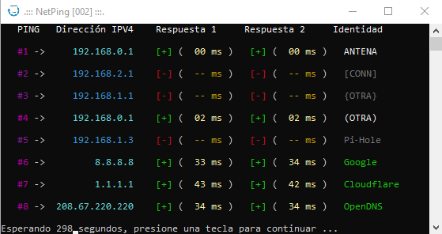
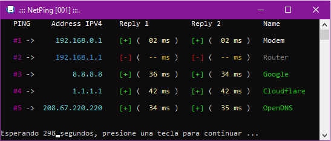

# NetPing
"Software para hacer ping a Direcciónes IPv4 en la red y mostrar resultado, con temporizador para actualizar."

- Use CodeBlocks o MS Visual Studio (C++) para compilar.
- O use la única versión son ejecutables para Windows x64

Funciones Actuales (código fuente o ejecutables)
* netHeartbeat
Hace Ping a 5 direcciones IP (2 locales, 3 de Internet)
Muestra resultados de 2 PING (Estado, Tiempo, IP, Nombre)
(Resultados con color para entender más fácilmente)

* NetPing
Limpiar resultados anteriores.
Ejecuta netHeartbeat.
Temporizador para repetir luego de 5 minutos (300 seg)

Puedes modificar el código fuente para establer tus propias direcciones IP a comprobar.

-------------------------------------------------------------
"Software to ping IPv4 Address on network and show results with timer to refresh."

- Use CodeBlocks o MS Visual Studio (C++) to compile.

- Or use unique-release executable Windows x64

Actual Functions (Source code or Executable):
* netHeartbeat
Make PING to 5 IP Address (2 Local and 3 Internet)
Show results of 2 PING (Status, Time, IP, TagName)
(Colored result to easy visual understanding)

* NetPing
Clear old results.
Execute netHeartbeat.
Timer to repeat after 5 minutes (300 sec)

You can to change source code to set your own IP Adress to check.
